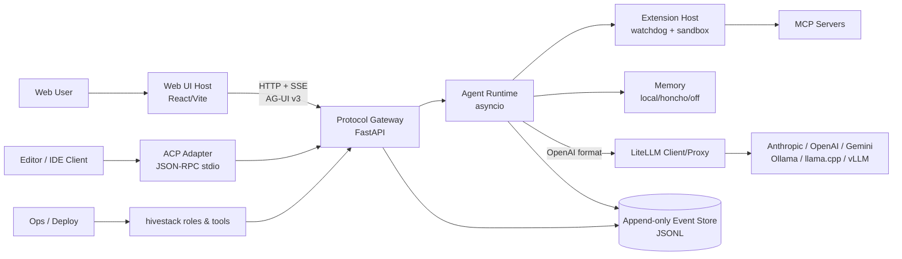
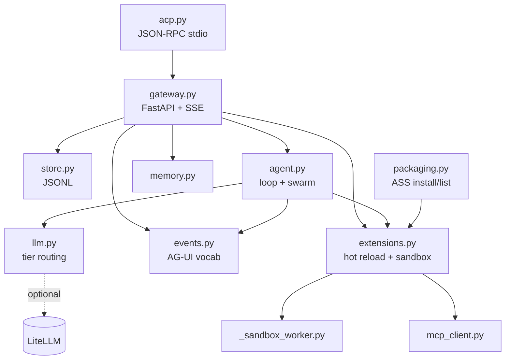
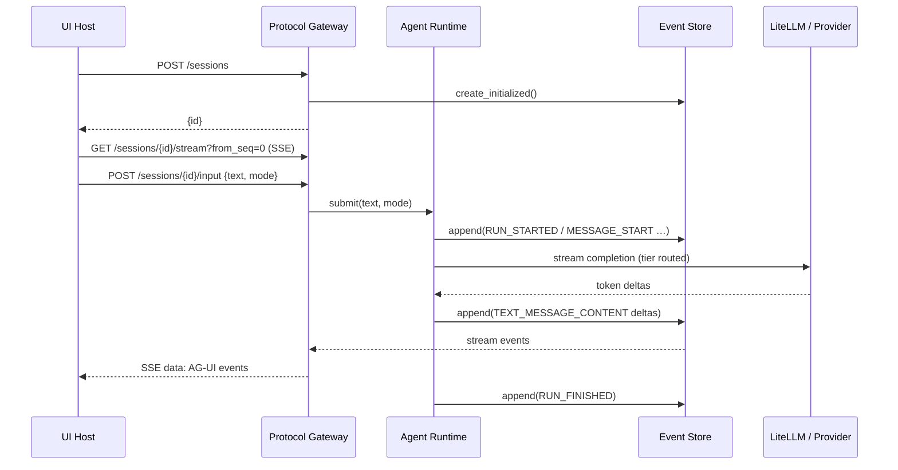
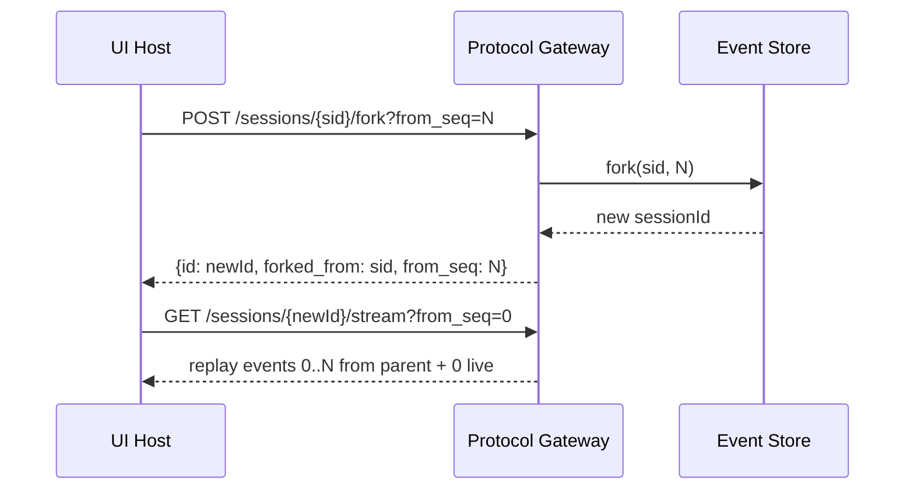
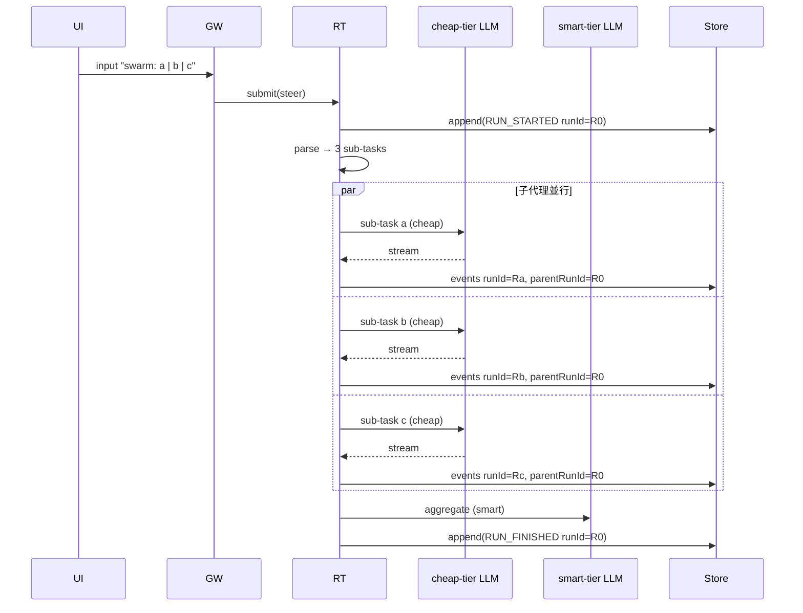
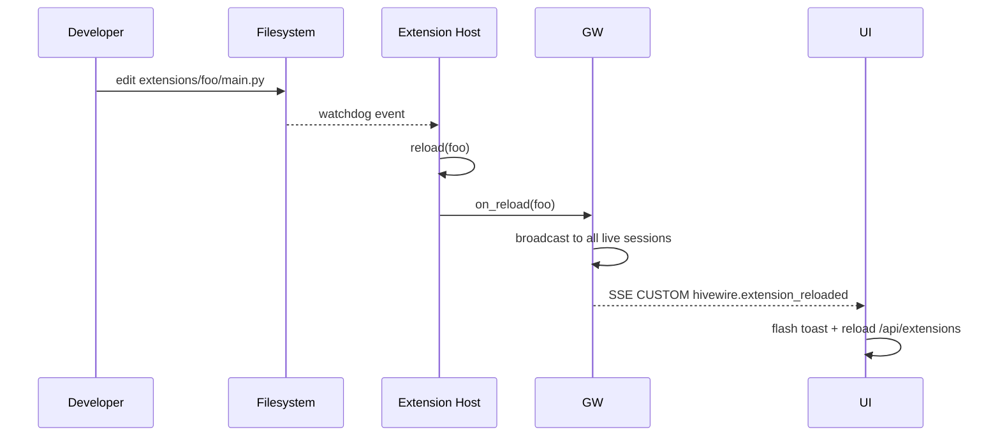
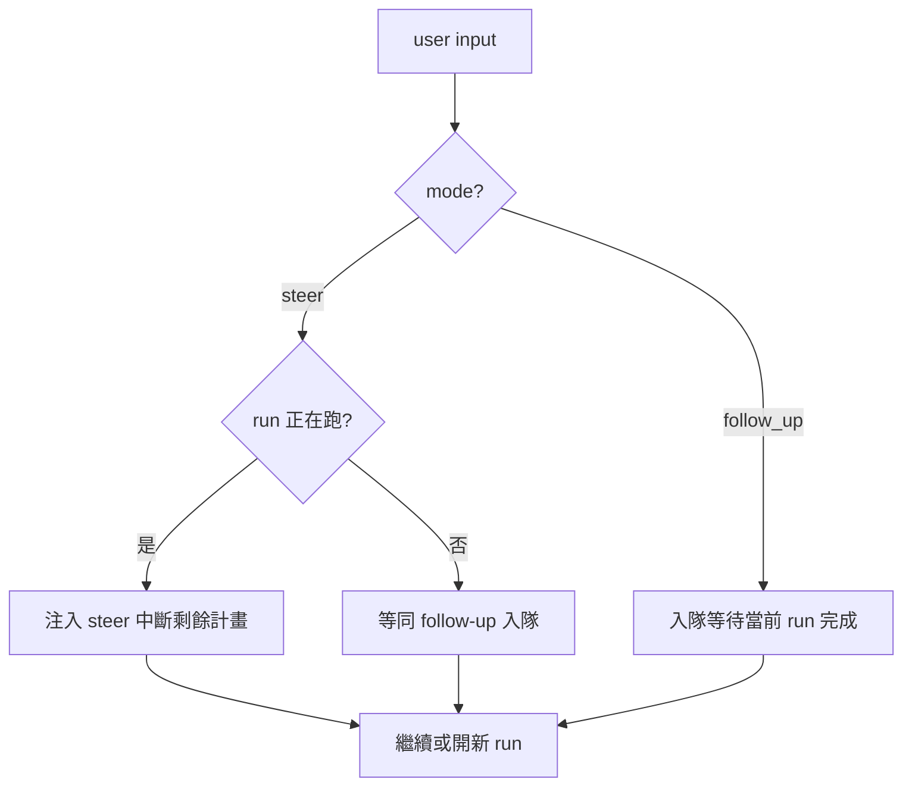

# Hivewire 產品架構文檔

本文件以「**業務架構 → 系統上下文 → 容器/組件 → 前端頁面層級 → 模塊依賴 → 交互邏輯**」逐層描述 Hivewire，並以與 **TRAE IDE 一致的空間佈局邏輯**（左側 Explorer / 主工作區 / 右側 Inspector / 底部 Panel）作為 UI 與功能組織的對齊基準。

| 欄位 | 內容 |
|---|---|
| 文件版本 | 2.1 |
| 對齊文件 | `doc/PRD.md` v2.1、`doc/Tech-Selection.md` v2.1 |
| 對齊實作 | `hivewire/src/hivewire/*`、`hivewire/ui/src/*`、`hivestack/*` |
| 最後更新 | 2026-06-08 |

---

## 1. 頂層業務架構（Business Architecture）

### 1.1 產品核心原語
**核心原語：session = append-only event log（JSONL）**

由此單一原語自然衍生四項核心能力（無需額外設計）：

| 能力 | 機制 |
|---|---|
| **Observable** | 任何 client 可訂閱同一條事件流（SSE） |
| **Resumable** | 從任意 seq 重連續傳（`?from_seq=N`） |
| **Versioned** | 每個 session 帶 `protocol_version`，可做兼容策略 |
| **Forkable** | 任意步 fork 新分支，形成 session tree |

### 1.2 業務能力域（Capability Domains）

| 能力域 | 輸入 | 輸出 | 主要責任 |
|---|---|---|---|
| **會話域 Session** | new / fork / input | sessionId、events、tree | 會話生命週期、分支、事件邏輯 |
| **協議域 Protocol** | HTTP / SSE | AG-UI 相容事件 | 對外協議與穩定性、客戶端兼容 |
| **編排域 Orchestration** | steer / follow-up / swarm | run、tool calls、messages | agent loop、並行、隊列 |
| **擴充域 Extensions** | manifest + code | tools / prompts / themes | hot reload、能力控制、沙箱 |
| **模型域 Model** | tier + context | stream completion | provider 無關、成本路由、mock fallback |
| **記憶域 Memory** | session history | recalled context | 召回策略、注入點、可關閉 |
| **客戶端域 Client** | events stream | UI 渲染 / Editor 命令 | UI host、ACP adapter |

### 1.3 設計原則（Architecture Tenets）

1. **協議優先（Protocol-first）**：UI / Editor / CLI 必須透過協議閘道接入，禁止直連 runtime。
2. **事件為單一事實（Event as SSoT）**：所有狀態變化先寫事件、再被 client 觀察。
3. **能力解耦（Capability Decoupling）**：tier 抽象模型、capability 抽象權限、kind 抽象擴充。
4. **熱迭代（Hot iteration）**：擴充修改不重啟；UI 自動 reflect。
5. **預設離線可跑（Offline-first）**：mock 模型 + JSONL store + 無外部依賴。
6. **IDE-class UX**：UI 空間佈局與互動模型對齊 TRAE IDE。

---

## 2. 系統上下文（System Context, C4-L1）

### 2.1 外部角色（Actors）
- **Web UI 使用者**：在瀏覽器使用 Hivewire UI host。
- **編輯器使用者**：透過 ACP（Zed / JetBrains / Neovim）使用同一 runtime。
- **擴充開發者**：撰寫 tool / mcp / prompt / theme 擴充並熱更新。
- **LLM 供應商 / 本地模型**：Anthropic / OpenAI / Gemini / Ollama / llama.cpp / vLLM。
- **MCP Server**：外部工具伺服器，透過 mcp 擴充接入。
- **部署運維**：使用 `hivestack/` 角色與腳本部署 / 監控。

### 2.2 Context Diagram



---

## 3. 容器 / 組件架構（Container & Component, C4-L2）

### 3.1 四層解耦（核心架構約定）

```
┌─────────────────────────────────────────────────────────┐
│   UI Host (React / Vite)         ← 純 AG-UI 訂閱者       │  L4
├─────────────────────────────────────────────────────────┤
│   Protocol Gateway (FastAPI)     ← HTTP / SSE / Store    │  L3
├─────────────────────────────────────────────────────────┤
│   Agent Runtime (Python)         ← loop / swarm / tools  │  L2
├─────────────────────────────────────────────────────────┤
│   Model Gateway (LiteLLM)        ← provider 抽象          │  L1
└─────────────────────────────────────────────────────────┘
```

| 層 | 職責 | 不可逾越 |
|---|---|---|
| **L4 UI Host** | 渲染會話樹與事件流；發送 input；操作 fork；展示 theme | 不得直連 runtime / store / model gateway |
| **L3 Protocol Gateway** | 對外 API、SSE 串流、會話管理、replay / fork、廣播 extension reload | 不得把 runtime 內部細節作為 UI 契約 |
| **L2 Agent Runtime** | agent loop、steer / follow-up、swarm fan-out、tool 調用、模型串流呼叫 | 不直接掃描檔案結構；不直連 provider |
| **L1 Model Gateway** | 多供應商 / 多後端路由、成本追蹤、mock fallback | 不知道 agent 業務語義 |

### 3.2 組件責任邊界（Boundary Rules）

| 邊界規則 | 內容 |
|---|---|
| **B1 UI 邊界** | UI Host 只對接 Gateway 的 HTTP / SSE，不依賴 Python 模型細節 |
| **B2 Gateway 邊界** | Gateway 管協議、會話、store；對 UI 暴露的 schema 必須是 AG-UI v3 + Hivewire CUSTOM 擴展 |
| **B3 Runtime 邊界** | Runtime 透過 Extension Host 取得工具 / 模板 / 主題；不直接讀檔 |
| **B4 Extension 邊界** | Capability allow-list = **策略邊界**；Sandbox = **執行隔離邊界**；兩者分開 |
| **B5 Model 邊界** | 上層使用 tier，禁止上層代碼出現具體模型名稱 |
| **B6 Memory 邊界** | Memory 策略可關（off），召回結果以 system message 注入，不影響事件結構 |

---

## 4. 前端頁面層級架構（Front-end IA / Page Hierarchy）

### 4.1 與 TRAE IDE 對齊的空間佈局

Hivewire UI 採用與 TRAE IDE 完全一致的四區域空間語義：

```
┌────────────────────────────────────────────────────────────┐
│  Header — brand · session id · actions · theme picker      │
├──────────┬──────────────────────────────┬──────────────────┤
│ L1       │  L2                          │  L3              │
│ Explorer │  Main Workspace              │  Inspector       │
│          │                              │  (規劃)           │
│ Sessions │  ┌────────────────────────┐  │                  │
│ Tree     │  │   Conversation Log     │  │  Run details     │
│          │  │   (Bubbles)            │  │  Tool I/O        │
│ ───      │  └────────────────────────┘  │  Model tier      │
│ Extens.  │  ┌────────────────────────┐  │  Event filter    │
│ (規劃)    │  │   Composer (footer)    │  │                  │
│          │  └────────────────────────┘  │                  │
├──────────┴──────────────────────────────┴──────────────────┤
│  Bottom Panel (規劃) — 連線 · 成本 · 錯誤 · Terminal         │
└────────────────────────────────────────────────────────────┘
```

| 區域 | 對應 TRAE | Hivewire 內容 |
|---|---|---|
| **L1 Explorer** | 檔案樹 | Sessions Tree（fork 結構）、未來：Extensions / Settings 清單 |
| **L2 Main** | 編輯器主區 | Conversation Log（按 runId 分軌的 bubbles） + Composer |
| **L3 Inspector** | 右側檢視（Agent / Outline） | Run 詳情、工具參數 / 結果、模型 tier、事件 filter / search |
| **Bottom Panel** | Terminal / Problems | 連線狀態、錯誤、性能 / 成本統計 |
| **Header** | 頂部工具列 | 品牌、session 短 ID、New、Theme picker |

### 4.2 視圖切分（Views, 而非路由）

當前以單頁應用承載，**以「視圖」而非多路由頁面**拆分（與 IDE 心理模型一致）：

| 視圖 | 狀態 | 內容 |
|---|---|---|
| **Workspace**（預設） | Done | Sessions Tree + Log + Composer |
| **Inspector**（可選） | Planned | Run / Tool / Filter 細節 |
| **Settings** | Planned | Model routing、Sandbox 模式、允許能力、Memory 策略 |
| **Extensions** | Planned | 已安裝擴充列表、狀態、能力宣告 |

### 4.3 組件樹（Component Tree）

```
<App>
├── <Header>
│   ├── SidebarToggle
│   ├── Brand
│   ├── SessionShortId
│   ├── NewSessionButton
│   └── ThemeSelect
├── <Toast>                  (條件渲染)
├── <Body flex-row>
│   ├── <Sidebar>            (L1)
│   │   ├── SidebarTitle "SESSIONS"
│   │   └── <SessionsTree>
│   │       └── <TreeNode>*  (遞迴 fork lineage)
│   ├── <MainCol>            (L2)
│   │   ├── <Log scrollable>
│   │   │   ├── <Empty>      (空狀態：title + hint + chips)
│   │   │   └── <Bubble>*    (user / assistant / tool / sub-agent)
│   │   │       ├── RoleLine + ForkButton
│   │   │       └── Text (pre-wrap)
│   │   └── <Composer footer>
│   │       ├── <Textarea>
│   │       └── <SendButton>
│   └── <Inspector>          (L3, Planned)
└── <BottomPanel>            (Planned)
```

---

## 5. 功能模塊依賴關係（Module Dependency）

### 5.1 Backend（Python）模塊依賴

對應 `hivewire/src/hivewire/`：



| 模組 | 依賴 | 輸出 |
|---|---|---|
| `gateway.py` | `store`、`agent`、`extensions`、`memory`、`events` | HTTP API、SSE 事件流 |
| `store.py` | 標準庫 + JSONL | session 事件落盤、`tree()` |
| `agent.py` | `llm`、`extensions`、`events` | steer / follow-up / swarm 行為 |
| `extensions.py` | `watchdog`、`_sandbox_worker`、`mcp_client` | tools / prompts / themes，reload 回調 |
| `llm.py` | `litellm`（可選）、`httpx` | 串流 completion；無模型則 mock |
| `events.py` | pydantic | AG-UI 事件 schema |
| `memory.py` | 標準庫（local）、honcho（可選） | recall 注入 |
| `acp.py` | `gateway`（HTTP）| Editor stdio bridge |
| `packaging.py` | git + 檔案系統 | ASS 包安裝 / 列表 |

### 5.2 Frontend（React）模塊依賴

對應 `hivewire/ui/src/`：

| 檔案 | 職責 | 依賴 |
|---|---|---|
| `main.tsx` | 應用入口，掛載 `<App>` | React、`App.tsx` |
| `App.tsx` | UI 主視圖：header / sidebar / log / composer；維護 sessionId、SSE、bubbles、runs、themes | React Hooks、`/api/*`（Vite proxy → Gateway） |

**API 邊界（Frontend → Backend）**：

| UI 行為 | API 呼叫 |
|---|---|
| 新 session | `POST /api/sessions` |
| 訂閱串流 | `new EventSource("/api/sessions/{id}/stream")` |
| 載入會話樹 | `GET /api/sessions/tree` |
| 載入擴充 / 主題 | `GET /api/extensions` |
| 送出輸入 | `POST /api/sessions/{id}/input` (`{text, mode}`) |
| Fork | `POST /api/sessions/{id}/fork?from_seq=N` |

**重要設計**：UI 只依賴 `/api/*`，且由 Vite proxy 指向 gateway，避免跨域並維持「一個 origin」的 IDE 式心智模型。

### 5.3 部署層（hivestack）

對應 `hivestack/`：

| 子目錄 | 內容 |
|---|---|
| `bin/` | 啟動 / 操作命令 |
| `commands/` | 任務型 CLI commands |
| `roles/` | 角色（如 dev / ops / agent）對應的設定與 prompt |
| `tools/` | 部署輔助工具 |
| `setup` | 一鍵 setup 腳本 |
| `docs/` | 部署與運維文件 |

**邊界**：`hivestack` 不直接 import `hivewire` 模組；以子進程 / HTTP API 互動，保持「部署層 vs. 產品層」鬆耦合。

---

## 6. 模塊交互邏輯（Interaction Logic）

### 6.1 Input → Run → Events 的主鏈路



### 6.2 Fork（Time-travel）鏈路



### 6.3 Swarm Fan-out 鏈路



### 6.4 Extension Hot Reload 鏈路



### 6.5 Steer vs Follow-up 決策



---

## 7. 架構與 UI 空間佈局的一致性檢核

為確保產品架構與 TRAE IDE 空間邏輯始終一致，建立以下**檢核點（Architectural Fitness Functions）**：

| # | 檢核點 | 預期 | 違規例 |
|---|---|---|---|
| C1 | L1 Explorer 只承載「結構化對象」 | Sessions Tree 為第一優先 | 把對話內容塞進 sidebar |
| C2 | L2 Main 承載「主要任務流」 | 對話 + 輸入 是核心 | 設定 / 列表擠壓 Log |
| C3 | L3 Inspector 承載「面向當前選中對象的細節」 | 信息密度高但非主線 | 把核心對話塞進 Inspector |
| C4 | Bottom Panel 承載「可收起的輔助信號」 | 狀態、錯誤、成本、Terminal | 把對話放進 Bottom |
| C5 | 視覺 token 唯一來源 | 所有色彩 / 字級 / 間距源於 PRD §8 token | 硬編碼色值或像素 |
| C6 | 鍵盤行為與 IDE 一致 | Enter / Shift+Enter / Alt+Enter / Esc / Cmd+K | 自創不直覺快捷鍵 |
| C7 | UI 不直連 runtime | 僅透過 `/api/*` | UI 內出現 model name / sandbox 細節 |
| C8 | 等寬字體用於 ID / seq / time | meta 一律 `ui-monospace` | ID 與內容字體混排錯位 |

---

## 8. 部署架構（Deployment View）

### 8.1 開發環境（Dev）

```
┌─────────────────────────────────────────────────┐
│  Browser (Chrome / Safari)                      │
│    ↓ http://127.0.0.1:5173                      │
│  Vite Dev Server (proxy /api → :8787)           │
│    ↓                                            │
│  hivewire gateway (uvicorn @ :8787)             │
│    ↓                                            │
│  Local JSONL store (data/sessions/*.jsonl)      │
│    ↓ optional                                   │
│  LiteLLM (docker compose @ :4000)               │
│    ↓                                            │
│  Local Ollama / Provider APIs                   │
└─────────────────────────────────────────────────┘
```

### 8.2 自託管生產（Self-host Prod）— Planned

```
┌─────────────────────────────────────────────────┐
│  Reverse Proxy (Caddy / nginx) — TLS + Auth     │
│    ↓                                            │
│  Hivewire Gateway (uvicorn behind systemd / k8s)│
│    ↓                                            │
│  Pluggable Store (SQLite / S3-compatible)       │
│    ↓                                            │
│  LiteLLM Proxy (multi-provider)                 │
│    ↓                                            │
│  Providers (Anthropic / OpenAI / Local)         │
│                                                 │
│  Extensions sandboxed in Docker (per-extension) │
└─────────────────────────────────────────────────┘
```

### 8.3 編輯器整合（ACP）

```
┌──────────────────────┐
│ Zed / JetBrains / Nvim│
└──────────┬───────────┘
           │ JSON-RPC over stdio
           ↓
┌──────────────────────┐
│ hivewire acp adapter │
└──────────┬───────────┘
           │ HTTP
           ↓
┌──────────────────────┐
│  Hivewire Gateway    │  ← 與 Web UI 共享同一 runtime / store
└──────────────────────┘
```

---

## 9. 演進路線（Evolution Roadmap, 架構面）

| 階段 | 架構演進 | 對應 PRD 里程碑 |
|---|---|---|
| Now | Inspector 面板（L3）落地；JSONL store 加抽象介面 | R5、R2 |
| Next | Pluggable store（SQLite / 物件儲存）；Bottom Panel；認證層 | R2、R7、R9 |
| Later | 多租戶 namespace；eval / replay 工具鏈；OTEL trace 全鏈路 | R4、R10、R11 |

---

## 10. 變更管理

- 任何破壞 §3.2（邊界規則）或 §7（檢核點）的 PR，必須在 PR description 內明示並徵求 ADR 變更。
- AG-UI 事件 schema 變更：必須升 `protocol_version`，並提供 client 兼容策略（R3）。
- UI token（色 / 字 / 間距）變更：必須同步更新 PRD §8 與本文 §4，並走 design review。

---

*本架構文檔以現有實作（`hivewire/src/hivewire/*`、`hivewire/ui/src/App.tsx`、`hivestack/*`）為事實基礎；空間佈局與檢核點以 TRAE IDE 截圖為視覺對齊基準。*
